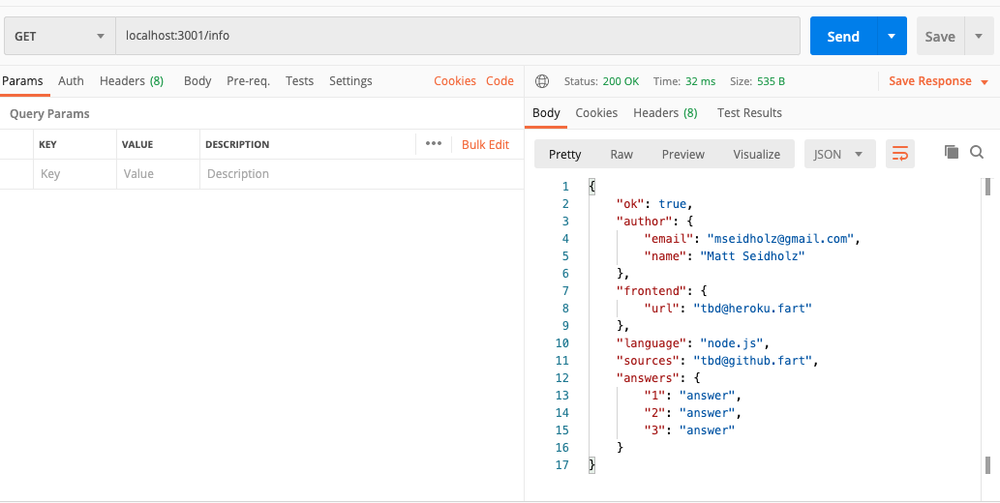
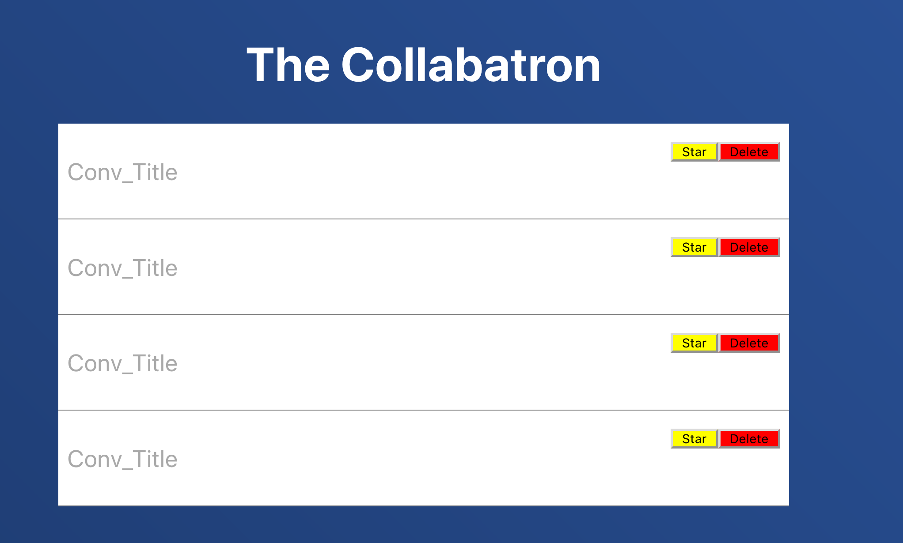
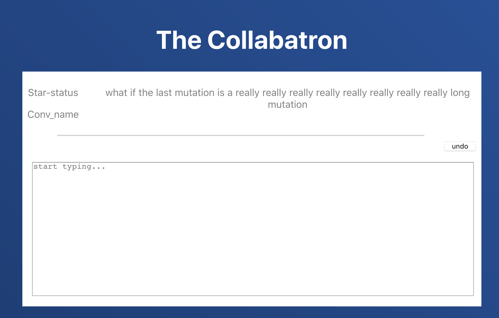
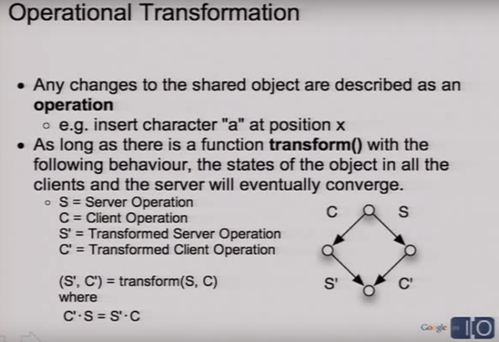
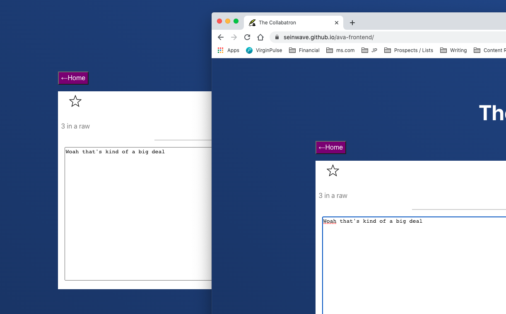
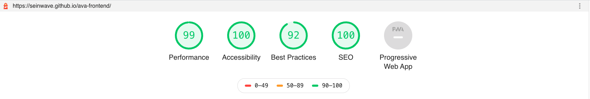

# The Ava Test

## TABLE OF CONTENTS
[Objective](https://github.com/seinwave/ava-test#objective)

[Development](https://github.com/seinwave/ava-test#development)
* [Step One: Orientation & Planning](https://github.com/seinwave/ava-test#step-one-orientation--planning)
* [Step Two: Dummy Front- & Back-ends](https://github.com/seinwave/ava-test#step-two-dummy-front-and-backends)
* [Step Two: Making Connections](https://github.com/seinwave/ava-test#step-three-making-connections)
    - [The `.txt` vs. `.json` issue](https://github.com/seinwave/ava-test#the-txt--json-issue)
    - [Star toggling & local storage](https://github.com/seinwave/ava-test#star-toggling--local-storage)
    - [Bonus functions](https://github.com/seinwave/ava-test#bonus-functions)
        - [New+](https://github.com/seinwave/ava-test#new)
        - [Rename](https://github.com/seinwave/ava-test#rename)
            - [`fs.rename()` vs `fs.renameSync()`](https://github.com/seinwave/ava-test#fsrename-vs-fsrenamesync)
            - [Subscription issue](https://github.com/seinwave/ava-test#the-subsciption-issue)
* [Step Four: The OT Algorithm](https://github.com/seinwave/ava-test#step-four-the-ot-algorithm)
    - [Trying to grok OT](https://github.com/seinwave/ava-test#trying-to-grok-ot)
    - [Knowing my limitations](https://github.com/seinwave/ava-test#knowing-my-limitations)
    - [A solution: shareDB](https://github.com/seinwave/ava-test#sharedb)
    - [Setting up shareDB](https://github.com/seinwave/ava-test#setting-up-sharedb)
* [Step Five: Auditing & Deployment](https://github.com/seinwave/ava-test#step-five-auditing--deployment)
    - [Lighthouse](https://github.com/seinwave/ava-test#lighthouse)
    - [Heroku + GH-pages](https://github.com/seinwave/ava-test#heroku--github-pages)
[Post-development Evaluation](https://github.com/seinwave/ava-test#post-development-evaluation)
* [Successes](https://github.com/seinwave/ava-test#successes)
    - [It works](https://github.com/seinwave/ava-test#functional-rt-collaboration)
    - [Legible code](https://github.com/seinwave/ava-test#legible-code)
* [Flaws](https://github.com/seinwave/ava-test#flaws)
    - [No author data](https://github.com/seinwave/ava-test#no-author-data)
    - [No focus on new conversation](https://github.com/seinwave/ava-test#no-focus-on-new-conversation)
    - [No persistence](https://github.com/seinwave/ava-test#no-focus-on-new-conversation)
    - [No undo](https://github.com/seinwave/ava-test#no-undo)
    - [Took too long](https://github.com/seinwave/ava-test#took-longer-than-id-like)


## Objective

Create a real-time collaborative conversation-transcription editor, for two humans to use concurrently. In the spirit of Google Docs, but for transcribed conversations.

Specifics include:

- A backend, deployed to a secure endpoint, that handles JSON-encoded requests.
- A frontend, written in a modern JS framework (like React), that allows various advanced interactions with the text.
- An OT algorithm that handles INSERT and DELETE mutations, from two different users.


## Development 

### Step One: Orientation / Planning

I'm resisting the urge to get coding right away. I want to take my time to orient myself to the challenge, and make a plan to move forward. 

Breaking down this project in to its parts, I see that some of it is comfortably in my wheelhouse, and some of it is not.

A Node backend, and a React frontend? Pretty familiar to me.

OT algorithms, on the other hand? Never heard of 'em, until seeing this challenge.

From [what](https://sharejs.org/) I [read](https://stackoverflow.com/questions/26694359/differences-between-ot-and-crdt?utm_medium=organic&utm_source=google_rich_qa&utm_campaign=google_rich_qa), implementing an industry-ready OT algorithm can be a bit of a bear. 

But my sense of this project is that I won't *need* to implement one, until I'm ready. For now I can focus on the basic parts of the frontend / backend, and find a passable OT library to handle text mutations.

So that's where I'll start — with dummy mockups for the front and backends

### Step Two: Dummy front and backends

First things first, I wanted to get my server up and running. 

That was easy enough. Configured some basic routes with `Node.js` and `Express`, and testing with `Postman`. Now, each route is returning what it's supposed to (roughly).

.

After that, I wanted to make a bare-bones version of the front-end, that roughly mimicked what the Ava test criteria are asking for:





It's not much. There's no routing. No functionality. You click a button and it does...nothing.

But it's there, and it's a start!

The next step will be to get the front- and back-ends talking with each other. 

### Step Three: Making connections

Hooking up the front- and back-end was straightforward, but with a few hiccups. Mostly, these had to do with how back-end routes interacted with state updates in React.

I'll try to explain. 

#### The `.txt` / `.json` issue
When I first set up the app's functionality, I stored all the conversations at `.txt` files in the server. Why I did that, I don't know. In retrospect, it's so obviously a bad idea. 

The `.txt` format didn't fit the complex operations I wanted to perform on these files. What if I wanted to re-write their contents? Or record their last mutations? Having no other fields but the file itself made that really difficult.

So, I had to revise the code. `JSON` was obviously the better choice. 

All the server routes / front end functions that were working with plain `.txt`, now had to work with `.json`s. Making this transition was less painful than I thought it would be. But it definitely slowed me down. 

#### Star toggling + local storage 
Another (smaller) issue I had was messing around with the `star` toggling. I realized that storing a conversation's `star` status in the React state wouldn't work — it would keep getting deleted on page refresh.

And I couldn't send the star-status to the backend, because the project brief specifically says that starring and un-starring should be local only. 

The best solution, I thought, was local-storage. And it works! 

### Bonus functions
In the process of development, I added two "bonus" functions that weren't described in the brief, but I believe enhance the app.
#### New+
This was my most important addition, I think. Since the project brief calls for the ability to *delete* conversations, I thought it was very important that the user be able to *add* them.

Otherwise, you could keep deleting conversations until there were none left — and then what? Have to use some server-side fiddling to get a new conversation in there?

Not ideal.

`New+` seemed like a fitting solution.

#### Rename
Since I added a `New+` button, I needed a default name for new conversations. I decided to do `NewConversation` + the last 3 digits of the Unix time-stamp of when the conversation was created.

But of course we don't want to keep that name! It's too weird! We need to be able to rename these conversations, too!

Hence, the `rename` route in the `conversations` part of the API.

It worked pretty well, except for two things...

##### fs.rename() vs fs.renameSync()
This was very frustrating, and hard to spot. 

At first, I tried firing my `rename` function with `fs.rename` in Node. Like this:

```
    fs.rename(oldPath, newPath, (err) => {
        if (err) console.log(err)
    });

    fs.writeFile(newPath, newConversationData, err =>{
        if (err) console.log(err);
    })
```

That got the job done...sometimes.

Other times, it would lead to errors, where the `fs.rename()` wouldn't finish, before `fs.writeFile()` began to rewrite the conversation's data.

As a result, the file's data would be mutated, but its *name* would stay the same. Suboptimal, to say the least!

So I had to rewrite the code, like so:

```
 
    fs.renameSync(oldPath, newPath, (err) => {
        if (err) console.log(err)
    });

    fs.writeFile(newPath, ready, err =>{
        if (err) console.log(err);
    })
```

The `Sync` makes all the difference. Now `fs.renameSync()` *has* to finish, before `fs.writeFile()` begins. 

#### The subsciption issue
A stubborn, thorny problem that I couldn't figure out before submission time. But later solved.

The issue was this. 

When you rename a *new* conversation, there's no problem.

But when you rename an *existing* conversation, the conversation's *content* goes away.

I solved this issue by changing how conversations were renamed.

Instead of overwriting the actual file name of the `.json`, I had the rename function just change the conversation's `id`. 

This way, the display name would always be the `id`, so the user could see a new name. But the actual `.json` would always have its original name — meaning that `shareDB` would have a persistent asset to subscribe to.

Problem solved!

### Step Four: The OT Algorithm
I raced to get the front-end and back-end done, so I could focus more time on the OT algorithm.

I knew it would be a doozy. Here's how I approached it.
#### Trying to grok OT
First, I tried to understand what Operational Transformation actually is.

A couple of YouTube videos got me to a rouch-sketch comprehension. [Google I/O 2009](https://www.youtube.com/watch?v=uOFzWZrsPV0&t=681s) was really helpful. So was [Google I/O 2013](https://www.youtube.com/watch?v=hv14PTbkIs0&t=1790s). 



But most helpful of all was this: [a real-time OT visualizer](https://operational-transformation.github.io/index.html).

This captured this exact flow of information, between two clients, and the server.

All this helped me arrive at a basic definition of the features of OT: 
- OT works on a *shared asset*, like a document
- Mutations to the shared asset are captured as *operations*, eg - insertions & deletions
- But mutations can conflict with each other, if they're not handled correctly
- To solve this problem, OT uses a transform() function, hosted both server-side and client-side, to achieve convergence between sets of mutations. 

#### Knowing my limitations
Now, understanding how that algorithm works is altogether different from being able to *write* it. 

And at this point, I had to acknowledge that writing my own OT algorithm, in the time allotted, is simply beyond my capabilities.

Other developers may be able to do that — but not me. 

Therefore, my choice was between shipping a nonfunctional app, or in achieving the real-time collaboration with a library. 

I chose a library. 

#### shareDB
Luckily, there's a pretty mature and open-source javascript-based real-time collaboration library, that uses OT as its foundation: [shareDB](https://github.com/share/sharedb).

While an extremely useful library, the React-specific documentation was...not wonderful. So I had to dig around into some rejected pull requests to find out how to deploy `shareDB` properly in my app.

[This is what I found](https://github.com/curran/sharedb/tree/routing-example/examples/textarea-routing). Very helpful!

(Incidentally, I have no idea why this pull request wasn't accepted into the main branch of `shareDB`'s repo.)


#### Setting up shareDB
Underlying shareDB is a websocket-based 'broadcast' from the server, which any number of clients can 'subscribe' to.

This flow of information ensures that any number of client windows can see updates to the shared asset.

Here's how it's configured on my server:

```
// ---- CONFIGURING OT BACKEND ----

// connecting server-hosted documents
// to shareDB backend
var connection = backend.connect();
  var doc = connection.get('textAreas', 'textarea');
  doc.fetch(function(err) {
    if (err) throw err;
    if (doc.type === null) {
      doc.create({content: ''});
      return;
    }
});


// creating a websocket-ready server,
// that shareDB is listening to
const server = http.createServer(app);
const wss = new WebSocket.Server({server: server});
wss.on('connection', (ws) => {
    const stream = new WebSocketJSONStream(ws);
    backend.listen(stream);
})
```

And here's how this connection is rendered in the `<Connection/>` component of my app:

```
const webSocket = new WebSocket('wss://ava-backend.herokuapp.com/');

const connection = new sharedb.Connection(webSocket);
export default connection;
```

Finally, here's how the 'subscription' happens in the `<Conversation/>` component, once it mounts:

```
componentDidMount(){
        // Get a reference to the textArea DOM node.
        const textArea = ReactDOM.findDOMNode(this.textArea.current);
        let targetConversation = this.props.conversations.filter(c => c.id === this.props.route);
        let stringData = targetConversation[0].content;

        // Create local Doc instance, mapped
        // to the current conversation
        const collection = 'textPads';
        const doc = connection.get(collection, `${this.props.route}.json`);

        // Getting operation details
        doc.on('op', (op) => {
            return this.opHandler(op);
        });
        
        // subscribe to the server's updates
        // on the document
        doc.subscribe(function(err) {
            if (err) throw err;
            createIfNeeded(doc, stringData, () => {    
            }); 
            const binding = new StringBinding(textArea, doc);
            binding.setup();
        });
    }
```

The most helpful detail to pick out here may be the `doc.on('op')` function, which captures each individual operation enacted on the shared asset.

This is what enables me to pass the `lastMutation` to the front and backend!

And once I got all that working, the App was basically done!

.

### Step Five: Auditing & Deployment
#### Lighthouse
When I wrap up a project, I like to do a quick [lighthouse](https://developers.google.com/web/tools/lighthouse/) audit, to see if I missed anything.

As it turns out, I missed quite a bit! Mostly on the accessibility front — which is sort of egregious, considering the purpose of this app!

But they were easy fixes. Adding labels, changing up some styles, etc. 

And I can't be too unhappy with my final score:



#### Heroku / Github pages
For deployment, I decided to go with my usual stack: `Heroku` and `gh-pages`. 

Why? They're both simple and intuitive services, and cheap. (Although I am paying the extra $$$ to make sure my `Heroku` dynamo never sleeps. Money well-spent, in my opinion.)

## Post-development evaluation
### Successes
#### Functional RT collaboration
First things first, the app works.

At least, it meets the demands set out in the brief. It doesn't crash. It relays errors. And it works reasonably well on different devices.

That's the biggest deal to me.

#### Legible code
Second, I'm happy with all the work I've done to document this effort. Lots of commenting in the code. Pretty sensible (at least, to me) directory structures. And reasonably clean functions.

There are certainly some areas where I could improve. But I think a programmer naive to this codebase could figure their way around, without too much help. 

### Flaws

#### No author data
Another thing I didn't have time to figure out: how to have author information appear in the front-end.

I know the brief calls for "Bob" and "Alice" clients — but I couldn't figure out how assign author info to every new client that engages with the App.

Again, sure there was a way to achieve this with the stack I've developed here. But I ran out of time.

#### No focus on new conversation
From a UX perspective, this one's a minor annoyance. When you create a new conversation, the browser doesn't focus on the newly-created element. Instead, you have to scroll down and *find* it. Blech!

I'd like to have it autofocus, but I ran out of time before figuring out how to do that on React, without messing up the app's functionality.

#### No 'undo'
The brief called for an 'undo' function as a bonus / extra. I was feeling ambitious, so I initially set out to do implemement an 'undo'. But I didn't. Again, with a little more time, I believe I could have. The clock got the better of me.

#### Lack of day-to-day persistence
This is a drawback of deploying on Heroku. Every day, the Heroku server's dynos reset. Which is good for maintenance purposes. But bad for preserving data. 

It means that every day, the existing conversations are erased. Bummer.

The fix is writing these conversations to an external database. (MongoDB would be my choice). 

But in the interest of putting the product out quickly (and because the challenge didn't mention storage), I went without.

Maybe in a future iteration, I'll include DB reads / writes. 

#### Took longer than I'd like 
Finally, this was my last disappointment. The brief asks you to spend ~6 hours on this project.

I blew past that, just getting the front- and back-end functionality going. Then another 3-4 hours figuring out how to implement an OT library. Then another hour or so for documentation.

Certainly exceeded the time-frame allotted! 


